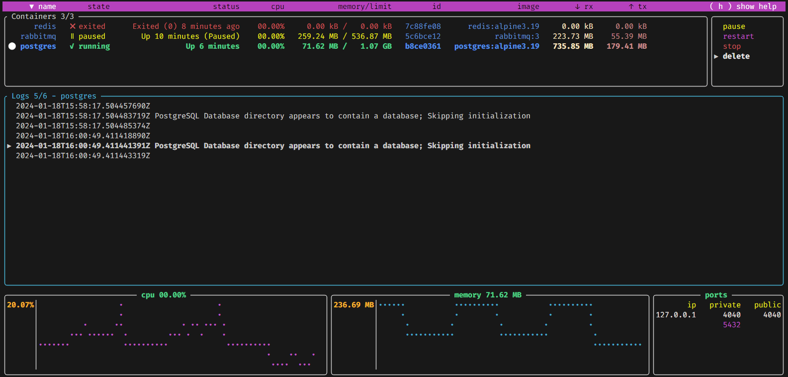

<p align="center">
	
	<br>
	<h1 align="center">oxker</h1>
	<div align="center">A simple tui to view & control docker containers</div>
</p>

<p align="center">
	Built in <a href='https://www.rust-lang.org/' target='_blank' rel='noopener noreferrer'>Rust</a>, making heavy use of <a href='https://github.com/fdehau/tui-rs' target='_blank' rel='noopener noreferrer'>tui-rs</a> & <a href='https://github.com/fussybeaver/bollard' target='_blank' rel='noopener noreferrer'>Bollard</a>
</p>

<p align="center">
	<a href="https://raw.githubusercontent.com/mrjackwills/oxker/main/.github/screenshot_01.png" target='_blank' rel='noopener noreferrer'>
		
	</a>
</p>


## Download & install

### Cargo
Published on <a href='https://www.crates.io/crates/oxker' target='_blank' rel='noopener noreferrer'>crates.io</a>, so if you have cargo installed, simply run

```cargo install oxker```

### Docker
Published on <a href='https://hub.docker.com/r/mrjackwills/oxker' target='_blank' rel='noopener noreferrer'>Docker Hub</a>, with images built for `linux/amd64`, `linux/arm64`, and `linux/arm/v6`

`docker run --rm -it -v /var/run/docker.sock:/var/run/docker.sock:ro --pull=always mrjackwills/oxker`

### Nix
Using nix flakes, oxker can be ran directly with

```nix run nixpkgs#oxker```

Without flakes, you can build a shell that contains oxker using

```nix-shell -p oxker```

### Pre-Built
See the <a href="https://github.com/mrjackwills/oxker/releases/latest" target='_blank' rel='noopener noreferrer'>pre-built binaries</a>

or, download & install (x86_64 one liner)

```bash
wget https://www.github.com/mrjackwills/oxker/releases/latest/download/oxker_linux_x86_64.tar.gz &&
tar xzvf oxker_linux_x86_64.tar.gz oxker &&
install -Dm 755 oxker -t "${HOME}/.local/bin" &&
rm oxker_linux_x86_64.tar.gz oxker
```

or, automatically select platform, download, and installation to `$HOME/.local/bin`

*One should verify all scripts before running in your shell*

```bash
curl https://raw.githubusercontent.com/mrjackwills/oxker/main/install.sh | bash
```

## Run

```oxker```

In application controls
| button| result|
|--|--|
| ```( tab )``` or ```( shift+tab )``` | change panel, clicking on a panel also changes the selected panel|
| ```( ↑ ↓ )``` or ```( j k )``` or ```(PgUp PgDown)``` or ```(Home End)```| change selected line in selected panel, mouse scroll also changes selected line |
| ```( enter )```| execute selected docker command|
| ```( 1-9 )``` | sort containers by heading, clicking on headings also sorts the selected column |
| ```( 0 )``` | stop sorting |
| ```( h )``` | toggle help menu |
| ```( m )``` | toggle mouse capture - if disabled, text on screen can be selected|
| ```( q )``` | to quit at any time |


Available command line arguments
| argument|result|
|--|--|
|```-d [number > 0]```| set the minimum update interval for docker information, in ms, defaults to 1000 (1 second) |
|```-r```| show raw logs, by default oxker will remove ANSI formatting (conflicts with -c) |
|```-c```| attempt to color the logs (conflicts with -r) |
|```-t```| remove timestamps from each log entry |
|```-s```| if running via docker, will show the oxker container |
|```-g```| no tui, basically a pointless debugging mode, for now |

## Build step

### x86_64

```cargo build --release```

### Raspberry pi

requires docker & <a href='https://github.com/cross-rs/cross' target='_blank' rel='noopener noreferrer'>cross-rs</a>

#### 64bit pi (pi 4, pi zero w 2)

```cross build --target aarch64-unknown-linux-gnu --release```

#### 32bit pi (pi zero w)

Tested, and fully working on pi zero w, running Raspberry Pi OS 32 bit, the initial logs parsing can take an extended period of time if thousands of lines long, suggest running with a -d argument of 5000

```cross build --target arm-unknown-linux-musleabihf --release```

If no memory information available, try appending ```/boot/cmdline.txt``` with

```cgroup_enable=cpuset cgroup_enable=memory```

see <a href="https://forums.raspberrypi.com/viewtopic.php?t=203128" target='_blank' rel='noopener noreferrer'>https://forums.raspberrypi.com/viewtopic.php?t=203128</a> and <a href="https://github.com/docker/for-linux/issues/1112" target='_blank' rel='noopener noreferrer'>https://github.com/docker/for-linux/issues/1112</a> 

### Untested on other platforms

## Tests

As of yet untested, needs work

```cargo test -- --test-threads=1```

Run some example docker images

using docker-compose.yml;

```docker compose -f docker-compose.yml up -d```

or individually

```docker run --name redis -d redis:alpine3.16```

```docker run --name postgres -e POSTGRES_PASSWORD=never_use_this_password_in_production -d postgres:alpine3.16```

```docker run -d --hostname my-rabbit --name rabbitmq rabbitmq:3```
