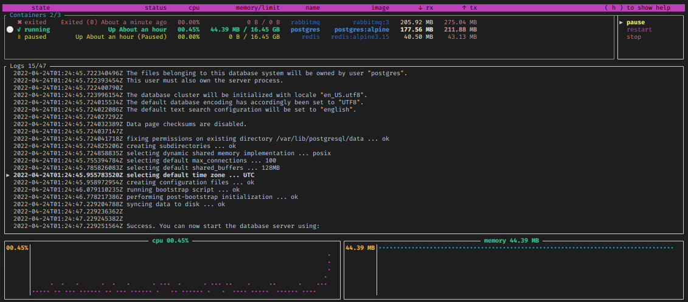

<p align="center">
 
</p>

<p align="center">
 <h1 align="center">oxker</h1>
</p>

<p align="center">
 A simple tui to view & control docker containers
</p>

<p align="center">
 Built in <a href='https://www.rust-lang.org/' target='_blank' rel='noopener noreferrer'>Rust</a>, making heavy use of <a href='https://github.com/fdehau/tui-rs' target='_blank' rel='noopener noreferrer'>tui-rs</a> & <a href='https://github.com/fussybeaver/bollard' target='_blank' rel='noopener noreferrer'>Bollard</a>
</p>

<p align="center">
	<a href="https://raw.githubusercontent.com/mrjackwills/oxker/main/.github/screenshot_01.jpg" target='_blank' rel='noopener noreferrer'>
		
	</a>
</p>


## Download & install 

See <a href="https://github.com/mrjackwills/oxker/releases" target='_blank' rel='noopener noreferrer'>releases</a>

install

```bash
tar xzvf oxker_linux_x86_64.tar.gz oxker
install -Dm 755 oxker -t "${HOME}/.local/bin"
rm oxker_linux_x86_64.tar.gz oxker
```
## Run

```oxker```

available command line arguments
| argument|result|
|--|--|
|```-d [number > 0]```| set the update interval for docker information, in ms |
|```-r```| Show raw logs, by default oxker will remove ANSI formatting (conflicts with -c) |
|```-c```| Attempt to color the logs (conflicts with -r) |
|```-t```| Remove timestamps from each log entry |
|```-g```| No tui, basically a pointless debugging mode, for now |

## Build step

### x86_64

```cargo build --release```

### Raspberry pi

requires docker & <a href='https://github.com/cross-rs/cross' target='_blank' rel='noopener noreferrer'>cross-rs</a>

#### 64bit pi (pi 4, pi zero w 2)

```cross build --target aarch64-unknown-linux-gnu --release```

#### 32bit pi (pi zero w)

Tested, and fully working on pi zero w, running Raspberry Pi OS 32 bit, the initial logs parsing can take an extended period of time if thousands of lines long, suggest running with a -d argument of 5000

```cross build --target arm-unknown-linux-musleabihf --release```

If no memory information available, try appending ```/boot/cmdline.txt``` with

```cgroup_enable=cpuset cgroup_enable=memory```

see <a href="https://forums.raspberrypi.com/viewtopic.php?t=203128" target='_blank' rel='noopener noreferrer'>https://forums.raspberrypi.com/viewtopic.php?t=203128</a> and <a href="https://github.com/docker/for-linux/issues/1112" target='_blank' rel='noopener noreferrer'>https://github.com/docker/for-linux/issues/1112</a> 

### Compress executable

compress output from \~3mb to ~1mb

```upx --best --lzma target/release/oxker -o ./oxker```

### Untested on other platforms

## Tests

As of yet untested, needs work

```cargo test -- --test-threads=1```

Run some example docker images

using docker-compose.yml;

```docker compose -f docker-compose.yml up -d```

or individually


```docker run --name redis -d redis:alpine3.15```

```docker run --name postgres -e POSTGRES_PASSWORD=never_use_this_password_in_production -d postgres:alpine```

```docker run -d --hostname my-rabbit --name rabbitmq rabbitmq:3```


