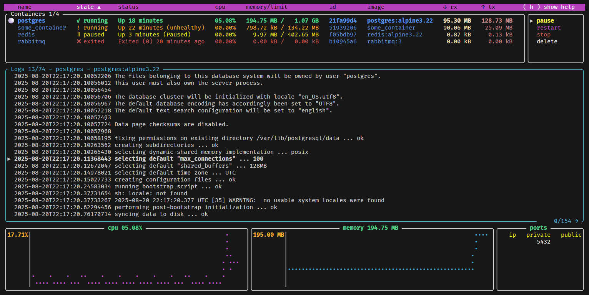

<p align="center">
	
	<br>
	<h1 align="center">oxker</h1>
	<div align="center">A simple tui to view & control docker containers</div>
</p>

<p align="center">
	Built in <a href='https://www.rust-lang.org/' target='_blank' rel='noopener noreferrer'>Rust</a>, making heavy use of <a href='https://github.com/tui-rs-revival/ratatui' target='_blank' rel='noopener noreferrer'>ratatui</a> & <a href='https://github.com/fussybeaver/bollard' target='_blank' rel='noopener noreferrer'>Bollard</a>
</p>

<p align="center">
	<a href="https://raw.githubusercontent.com/mrjackwills/oxker/main/.github/screenshot_01.png" target='_blank' rel='noopener noreferrer'>
		
	</a>
</p>

- [Download & install](#download--install)
- [Run](#run)
- [Build step](#build-step)
- [Tests](#tests)

## Download & install

### Cargo
Published on <a href='https://www.crates.io/crates/oxker' target='_blank' rel='noopener noreferrer'>crates.io</a>, so if you have cargo installed, simply run


```shell
cargo install oxker
```

### Docker

Published on <a href='https://hub.docker.com/r/mrjackwills/oxker' target='_blank' rel='noopener noreferrer'>Docker Hub</a> and <a href='https://ghcr.io/mrjackwills/oxker' target='_blank' rel='noopener noreferrer'>ghcr.io</a>,
with images built for `linux/amd64`, `linux/arm64`, and `linux/arm/v6`

**via Docker Hub**
```shell
docker run --rm -it -v /var/run/docker.sock:/var/run/docker.sock:ro --pull=always mrjackwills/oxker
```

**via ghcr.io**

```shell
docker run --rm -it -v /var/run/docker.sock:/var/run/docker.sock:ro --pull=always ghcr.io/mrjackwills/oxker
```

### Nix
Using nix flakes, oxker can be ran directly with

```shell
nix run nixpkgs#oxker
```

Without flakes, you can build a shell that contains oxker using

```shell
nix-shell -p oxker
```

### AUR

oxker can be installed from the [AUR](https://aur.archlinux.org/packages/oxker) with using an [AUR helper](https://wiki.archlinux.org/title/AUR_helpers):

```shell
paru -S oxker
```

### Homebrew

oxker can be installed on macOS using [Homebrew](https://formulae.brew.sh/formula/oxker):

```shell
brew install oxker
```

### Pre-Built
See the <a href="https://github.com/mrjackwills/oxker/releases/latest" target='_blank' rel='noopener noreferrer'>pre-built binaries</a>

or, download & install (x86_64 one liner)

```shell
wget https://www.github.com/mrjackwills/oxker/releases/latest/download/oxker_linux_x86_64.tar.gz &&
tar xzvf oxker_linux_x86_64.tar.gz oxker &&
install -Dm 755 oxker -t "${HOME}/.local/bin" &&
rm oxker_linux_x86_64.tar.gz oxker
```

or, for automatic platform selection, download, and installation (to `$HOME/.local/bin`)

*One should always verify <a href='https://github.com/mrjackwills/oxker/blob/main/install.sh' target='_blank' rel='noopener noreferrer'>script content</a> before running in a shell*

```shell
curl https://raw.githubusercontent.com/mrjackwills/oxker/main/install.sh | bash
```

## Run

```shell
oxker
```
In application controls, these, amongst many other settings, can be customized with the [config file](#Config-File)
| button| result|
|--|--|
| ```( tab )``` or ```( shift+tab )``` | Change panel, clicking on a panel also changes the selected panel.|
| ```( ↑ ↓ )``` or ```( j k )``` or ```( PgUp PgDown )``` or ```( Home End )```| Change selected line in selected panel, mouse scroll also changes selected line.|
| ```( enter )```| Run selected docker command.|
| ```( 1-9 )``` | Sort containers by heading, clicking on headings also sorts the selected column. |
| ```( 0 )``` | Stop sorting.|
| ```( F1 )``` or ```( / )``` | Enter filter mode. |
| ```( e )``` | Exec into the selected container - not available on Windows.|
| ```( h )``` | Toggle help menu.|
| ```( m )``` | Toggle mouse capture - if disabled, text on screen can be selected.|
| ```( q )``` | Quit.|
| ```( s )``` | Save logs to `$HOME/[container_name]_[timestamp].log`, or the directory set by `--save-dir`.|
| ```( esc )``` | Close dialog.|

Available command line arguments

| argument|result|
|--|--|
|```-d [number > 0]```| Set the minimum update interval for docker information in milliseconds. Defaults to 1000 (1 second).|
|```-r```| Show raw logs. By default, removes ANSI formatting (conflicts with `-c`).|
|```-c```| Attempt to color the logs (conflicts with `-r`).|
|```-t```| Remove timestamps from each log entry.|
|```-s```| If running via Docker, will display the oxker container.|
|```-g```| No TUI, essentially a debugging mode with limited functionality, for now.|
|```--config-file [string]```| Location of a `config.toml`/`config.json`/`config.jsonc`. By default will check the users local config figuration directory.|
|```--host [string]```| Connect to Docker with a custom hostname. Defaults to `/var/run/docker.sock`. Will use `$DOCKER_HOST` environment variable if set.|
|```--no-stderr```| Do not include stderr output in logs.|
|```--save-dir [string]```| Save exported logs into a custom directory. Defaults to `$HOME`.|
|```--timezone [string]```| Display the Docker logs timestamps in a given [timezone](https://en.wikipedia.org/wiki/List_of_tz_database_time_zones). Defaults to `Etc/UTC`.|
|```--use-cli```| Use the Docker application when exec-ing into a container, instead of the Docker API.|

### Config File


A config file enables the user to persist settings, it also enables the user to create a custom keymap, and set the color scheme used by the application.
<br>
<br>
By default, if not found, `oxker` will create a config file in the user's local config directory. Command line arguments take priority over values from the config file.
<br>
<br>
`oxker` supports `.toml`,`.json`, and `.jsonc` file formats. Examples of each can be found in the [example_config](https://github.com/mrjackwills/oxker/tree/main/example_config) directory.

If running an `oxker` container, the default config location will be `/config.toml` rather than the automatically detected platform-specific local config directory.

```shell
docker run --rm -it -v /var/run/docker.sock:/var/run/docker.sock:ro -v /some/location/config.toml:/config.toml:ro oxker
```

## Build step

### x86_64

```shell
cargo build --release
```

### Raspberry pi

requires docker & <a href='https://github.com/cross-rs/cross' target='_blank' rel='noopener noreferrer'>cross-rs</a>

#### 64bit pi (pi 4, pi zero w 2)

```shell
cross build --target aarch64-unknown-linux-gnu --release
```

#### 32bit pi (pi zero w)

Tested, and fully working on pi zero w, running Raspberry Pi OS 32 bit, the initial logs parsing can take an extended period of time if thousands of lines long, suggest running with a -d argument of 5000

```shell
cross build --target arm-unknown-linux-musleabihf --release
```

If no memory information available, try appending either ```/boot/cmdline.txt``` or ```/boot/firmware/cmdline.txt``` with

```cgroup_enable=cpuset cgroup_enable=memory```

see <a href="https://forums.raspberrypi.com/viewtopic.php?t=203128" target='_blank' rel='noopener noreferrer'>https://forums.raspberrypi.com/viewtopic.php?t=203128</a> and <a href="https://github.com/docker/for-linux/issues/1112" target='_blank' rel='noopener noreferrer'>https://github.com/docker/for-linux/issues/1112</a> 


### Untested on other platforms


## Tests

~~As of yet untested, needs work~~

The work has been done, so far the tests don't effect any running containers, but this may change in the future.

```shell
cargo test
```

Run some example docker images

using docker/docker-compose.yml;

```shell
docker compose -f ./docker/docker-compose.yml up -d
```

or individually

```shell
docker run --name redis -d redis:alpine3.21
```

```shell
docker run --name postgres -e POSTGRES_PASSWORD=never_use_this_password_in_production -d postgres:alpine3.21
```

```shell
docker run -d --hostname my-rabbit --name rabbitmq rabbitmq:3
```
